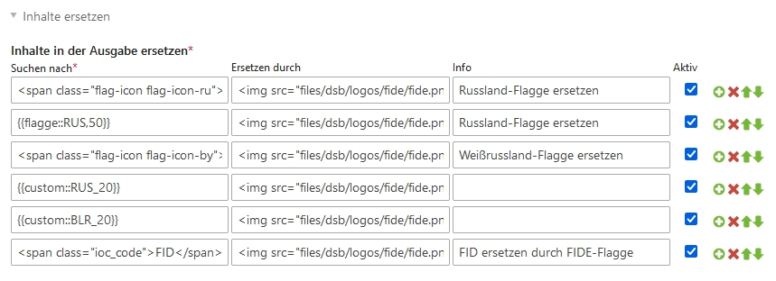

# Templateparser für Contao

Mit dieser Erweiterung können Sie vor der Auslieferung an den Browser Inhalte ersetzen.

## Anleitung

Die Einstellungen für die Ersetzungen nehmen Sie unter System -> Einstellungen vor:
 

Die Beispielkonfiguration in der Grafik zeigt sechs aktive Ersetzungen. Sie können beliebig viele Ersetzungen vornehmen und diese ggfs. deaktivieren ohne sie löschen zu müssen.

**Frank Hoppe**
